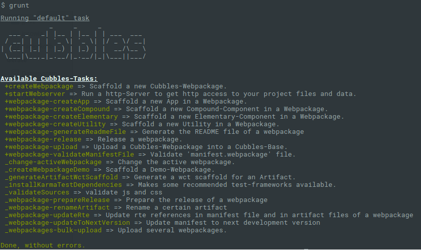

# Coder devtools - CDT

The **Coder DevTools** are a [Node.js](https://nodejs.org/) based set of tools, that allow you to build, maintain and share Cubbles components \(into a Base\). Implementation of components is done on javascript source code level.

Running the grunt command within a CDT folder you will get the list of available grunt tasks.

