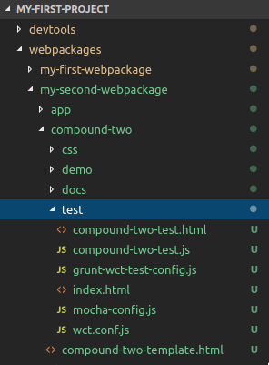

# Generate a test environment for a component

The [CDT](../README.md) offers the `_generateArtifactWctScaffold` task to generate unit tests for your Cubbles components, which is based on [web-component-tester v. 4.2.2](https://www.npmjs.com/package/web-component-tester/v/4.2.2). You can test your cubbles components using [Mocha](https://mochajs.org/) as test framework and [Chai](https://www.chaijs.com/) for assertions.

## Purpose

To show how to generate a test environment for your Cubbles components using the `_generateArtifactWctScaffold` and how to test them.

## Steps

First, you should run the task within the CDT folder (normally it is called *devtools*) as follows:

```bash
grunt _generateArtifactWctScaffold
```

Then, a list of the components of the [current active webpackage](change-active-webpackage.md) will be displayed. You should choose the component to be tested typing its index. In the example below, we have chosen to generate a test environment for the second component of the list:

```bash
? Please choose the artifact
  1) elem-one
  2) compound-two
(Move up and down to reveal more choices)
  Answer: 2
```

## Outcome

A folder called *test* will be generated in the folder of the selected component.



The folder will contain the following files:

* **index.html**: the index webpage to run the tests in a browser.
* **\[artifactId\]-test.html**: a webpage containing the component to be tested and importing the required scripts.
* **\[artifactId\[-test.js**: script to write the unit tests of your component.
* **grunt-wct-test-config.js**, **mocha-config.js** and **wct.conf.js**: configuration files for the test environment of the component.

After generating the files, you will get a message similar to the one presented below:

```bash
info: finished generation files in: ../../my-first-project/webpackages/my-second-webpackage/compound-two/test
```

## The npm module version

You can use an npm module that serves the same purposes called [cubx-wct-scaffolder](https://www.npmjs.com/package/cubx-wct-scaffolder). The module can be used from the command line or in a node script.

## Further details

To know how to write unit tests for you components check [this tutorial](testing-components.md).