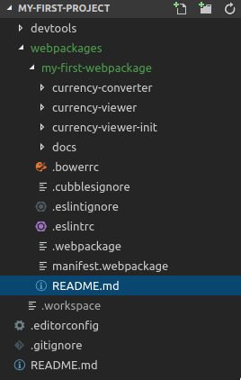

# Generate a README file

When you have developed a webpackage, it may be useful to include a README file indicating the artifacts it contains and an example describing how to use one of the components it contains. The [CDT](../README.md) provides you with a task to generate a README file for your package automatically. The task is called `+webpackage-generateReadmeFile`.

## Purpose

To generate a README file for the current webpackage (which can be set in the `project/webpackages/.workspace` file). The file should present:

* A list of artifacts of a webpackage
* A demo code indicating how to use a component of that webpackage
* A demo code indicating how to initialise that component

The expected output is a file similar to the one presented this [README.md file](https://github.com/iCubbles/my-first-project/blob/master/webpackages/my-first-webpackage/README.md).

## Use case

In this tutorial, we will generate a README file for the webpackage we created in the [Create a webpackage](../../first-steps/create-a-webpackage.md) tutorial to describe each step. However, the process is the same for all webpackages.

## Steps

To generate the README file, you should run the task following task:

```bash
grunt +webpackage-generateReadmeFile
```

Then, you will be asked to provide a description for your webpackage. For our case it will be "Webpackage to demonstrate the use of Cubbles components".

After that, you should provide the name of the base where the webpackage is or will be hosted. In our case, it is "sandbox".

Then, you should indicate whether you want to include a demo code using a component. If you don't want to generate a demo, type "n"; otherwise, type "Y". In the negative case, the process wil finish. We will type "Y" to generate the code.

Now, a list with the components of the current webpackage will be displayed. You should choose the one to be used to generate the demo code. In our case, we will choose the `currency-converter` component.

Then, if the chosen component has input slots, you should indicate whether you want to include a demo code to show how to init your component in the HTML code. As previously, you should type "Y" or "n". In our case, we type "Y".

After that, a list with the available slots will be displayed. You should choose the one to be used to init the demo component. In our case, we will choose the `base` slot.

Finally, you should provide the value for that slot. In this case, it will be "EUR".

The whole process is illustrated below:

```
$ grunt +webpackage-generateReadmeFile
Currently mapped Webpackage: my-first-webpackage (@see ../webpackages/.workspace)

Running "+webpackage-generateReadmeFile" task
? Provide a short description of the webpackage Webpackage to demonstrate the use of Cubbles components
? Provide the name of the base or store where the webpackage will be available sandbox
? Would you like to include a demo using one component? Yes
? Provide the artifactId of the component to be use as demo. currency-converter
? Would you like to include a demo on how to initialise the component? Yes
? Select the name of the slot to be used to initialise the demo component. base
? Provide the value of the slot to be used to initialise the demo component. "EUR"

Done, without errors.
```

A **README.md** file will be generated in the folder of the current webpackage.



## The npm module version

You can use an npm module that serves the same purposes called [cubx-generate-webpackage-readme-file](https://www.npmjs.com/package/cubx-generate-webpackage-readme-file). The module can be used from the command line or in a node script.