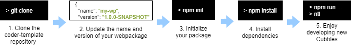
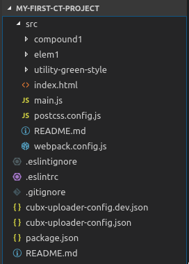

# Creating a new project

Creating a project using the [vanilla boilerplate](https://github.com/cubblesmasters/vanilla) as boilerplate is a very simple process as illustrated in the image below and detailed in the following sections.



## Cloning the vanilla boilerplate repository

To create a new Cubbles project, you should clone or download the 'vanilla boilerplate' from its [repository](https://github.com/cubblesmasters/vanilla), which is an npm based package that uses [webpack](https://webpack.js.org/) as bundler tool. We will create a project called 'my-first-ct-project'. The following code will clone the repository in a folder called as our desired repository:

```bash
git clone https://github.com/cubblesmasters/vanilla.git my-first-ct-project
```

After that, you should have a folder structure like the one below:



### Boilerplate content

#### The 'src' folder

In the root of the project, you can find a 'src' folder that contains the source code of the developed artifacts. Also, this folder contains the config files required by webpack to build a distribution version that follows the structure of a [Cubbles webpackage](../terms-and-concepts/webpackage.md).

The vanilla boilerplate includes three folders containing sample [artifacts](../terms-and-concepts/artifacts):

1. **elem1**: this folder contains an elementary component sample, which includes:
   1. The **element.html** file: it contains the view of the sample elementary.
   2. The **element.js** file: it contains the logic of the sample elementary.
   3. The **element.sss** file: it contains the style of the sample elementary.
   4. The **MANIFEST.elementary.js**: it contains only the [manifest definition](../terms-and-concepts/artifacts.md#artifact-definition) of the sample elementary. As you may notice, it is a javascript script; thus, you have more freedom to play with the definition, but at the end, it should be [Cubbles manifest](http://cubbles.github.io/cubx-webpackage-document-api/schema-explorer.html?schemaPath=https://raw.githubusercontent.com/cubbles/coder-toolset/develop/packages/webpackage-document-api/lib/jsonSchema/manifestWebpackage-10.1.0.schema.json) valid.
   5. The **SHOWROOM.html** file: it contains a demo of the component.
   6. The **webpack.subconfig.js** file: it contains a base webpack config for elementary components.
2. **compound1**: this folder contains a compound component sample, which includes the same files of **elem1** folder. But, in this case, **element.js** file only imports the style of the compound. Remember that, compound components have no associated logic.
3. **utility-green-style**: this folder contains a utility sample. The **c-util.js** and **c-util.sss** are just sample code; in a real case, those should be the files of a library or utility that you want to use.

The MANIFEST definition of each artifact in the 'src' folder will be joint to produce a single valid [Cubbles webpackage manifest](http://cubbles.github.io/cubx-webpackage-document-api/schema-explorer.html?schemaPath=https://raw.githubusercontent.com/cubbles/coder-toolset/develop/packages/webpackage-document-api/lib/jsonSchema/manifestWebpackage-10.1.0.schema.json). The final manifest will be bundled by *webpack* in a 'dist' folder after building the project.

#### The 'package.json' file

This is a common npm package definition file. It contains the required dependencies to develop, build, validate and upload Cubbles artifacts. Those tasks can be carried out running the scripts listed in the file using [ntl](https://www.npmjs.com/package/ntl) or simply running the command 'npm run [script-name]'.

##### The cubbles property

In the *package.json* file, you can provide Cubbles related information for your webpackage. To aim that, you should assign a property called "cubbles", which is an object with the following properties:

| Property      | Type         | Description                                                                                                                                                                                                                                                                                                                                                                         | Sample                                                                                                                                                                                                                                                                                                |
|---------------|--------------|-------------------------------------------------------------------------------------------------------------------------------------------------------------------------------------------------------------------------------------------------------------------------------------------------------------------------------------------------------------------------------------|-------------------------------------------------------------------------------------------------------------------------------------------------------------------------------------------------------------------------------------------------------------------------------------------------------|
| coder-toolset | object       | A property to set coder-toolset related information. By the moment, it only has one property:  *cubx-webpackage-uploader*, which allows providing upload configuration as explained [here](../coder-devtools-cdt/user-guide/upload-a-webpackage#initial-setup).                                                                                                                                                                                       | {     cubx-webpackage-uploader: {        dev: {         source": "test/testdata/packages/package1",         target": {           url: "http://localhost:5984/sandbox",           path: "_api/upload",           proxy: "http://proxy.de:80"         },         debug: true      }    } |
| modelVersion  | string       | modelVersion of your webpackage. Version of the webpackage specification. See [this](http://cubbles.github.io/cubx-webpackage-document-api/schema-explorer.html?schemaPath=https://raw.githubusercontent.com/cubbles/coder-toolset/develop/packages/webpackage-document-api/lib/jsonSchema/manifestWebpackage-10.1.0.schema.json) for more info.                                    | "10.1.0"                                                                                                                                                                                                                                                                                              |
| groupId       | string       | Th groupId of your webpackage. Use this to define/select a namespace for the webpackage (e.g. org.example). See [this](http://cubbles.github.io/cubx-webpackage-document-api/schema-explorer.html?schemaPath=https://raw.githubusercontent.com/cubbles/coder-toolset/develop/packages/webpackage-document-api/lib/jsonSchema/manifestWebpackage-10.1.0.schema.json) for more info.  | "org.example"                                                                                                                                                                                                                                                                                         |
| runnables     | array        | Runnables of your webpackage. Resources that are actually runnable in a users webbrowser. See [this](http://cubbles.github.io/cubx-webpackage-document-api/schema-explorer.html?schemaPath=https://raw.githubusercontent.com/cubbles/coder-toolset/develop/packages/webpackage-document-api/lib/jsonSchema/manifestWebpackage-10.1.0.schema.json) for more info.                    | [     {         "name": "readme",         "path": "/doc/readme.html",         "description": "Read this ..."     }  ]                                                                                                                                                                                 |
| man           | string\|array | 1..n urls to external manual(s) related to your webpackage. See [this](http://cubbles.github.io/cubx-webpackage-document-api/schema-explorer.html?schemaPath=https://raw.githubusercontent.com/cubbles/coder-toolset/develop/packages/webpackage-document-api/lib/jsonSchema/manifestWebpackage-10.1.0.schema.json)                                                                 | [    "http://project.com/man",    "http://project.com/man2" ]                                                                                                                                                                                                                                         |

#### Other config files

Also, the root folder contains common config files such as *.gitignore* and *.eslintrc*.

## Initializing your package

Now, you need to initialize your package using the `npm init` command.

> Remember that the name of the package will be used to generate the `webpackageId` of your webpackage. Which in the sample case would be `my-first-ct-project`.

## Running 'npm install'

As usual, you should run the `npm install` command to install all the required dependencies of your package. If everything goes well, you will be able to use the [available scripts](./available-scripts.md) to develop, build, validate and upload your webpackage.