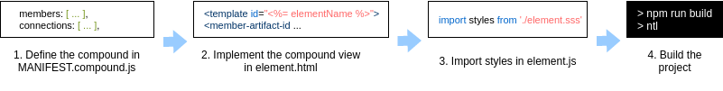

# Developing compounds using the vanilla boilerplate

The easiest way to develop Cubbles compounds is to modify the base sample contained in the vanilla boilerplate. In this section, we will give you some recommendations to help you with that process. Below, we present an overview of the development process of a compound:



## Prerequisites

To start developing Cubbles compounds using the vanilla boilerplate, this should be cloned locally and all its dependencies should be installed (See [this guide](./creating-project.md) for more information).

## Development considerations

The `vanilla boilerplate` includes a boilerplate for a compound component called `compound1`. A compound component has a manifest definition and optionally a view. You should rename its container folder according to your needs. The name of the folder will be used to set the `artifactId` of your compound in the dist version of the final manifest.

Additionally, you should edit the following files according to your needs:

### The **MANIFEST.compound.js**

It contains only the [manifest definition](../terms-and-concepts/artifacts.md#artifact-definition) of the compound. As you may notice, it is a javascript script; thus, you have more freedom to play with the definition, but after building, it should be JSON and [Cubbles manifest](http://cubbles.github.io/cubx-webpackage-document-api/schema-explorer.html?schemaPath=https://raw.githubusercontent.com/cubbles/coder-toolset/develop/packages/webpackage-document-api/lib/jsonSchema/manifestWebpackage-10.1.0.schema.json) valid.

The following are the valid properties of an elementary manifest definition:

```javascript
{
  "artifactId": , // Set automatically during building process
  "resources": [],
  "members": [],
  "connections": [],
  "slots": [], // Optional
  "inits": [], // Optional
  "dependencies": [], // Optional
  "runnables": [], // Optional
  "dependencyExcludes": [], // Optional
  "description": "A description" // Optional
}
```

> Check [this](http://cubbles.github.io/cubx-webpackage-document-api/schema-explorer.html?schemaPath=https://raw.githubusercontent.com/cubbles/coder-toolset/develop/packages/webpackage-document-api/lib/jsonSchema/manifestWebpackage-10.1.0.schema.json) to know the type and structure of values that each property can take.

#### About the artifactId

The `artifactId` of your compound is set automatically during the building process. By default it has the following format: `[webpackageId]-[artifactId]`. The `webpackageId` will be determined from the `name` property of the `package.json` file. And the `artifactId` will be based on the name of the folder that contains the component.

For instance, the artifactId of the `compound1` compound contained in `vanilla boilerplate` will be `cubbles-vanilla-boilerplate-compound1`, since the `name` property of the `package.json file` is *@cubbles/vanilla boilerplate* and the container folder is called *compound1*. Note that the special characters (i.e., @ and /) of the name property were removed since `artifactIds` should be valid HTML elements names.

### The **element.html** file

It contains the view of the compound. You can remove the sample code except for `<template>` tag, inside you should add the html code of your elementary. Also, have into account that the `id="<%= elementName %>"` attribute of that tag will be replaced with the `artifactId` defined in the `MANIFEST.compound.js`. If you remove this attribute your elementary will not work properly. Similarly, if you hard code the id attribute and then change the artifactId in the manifest, you will have to update this manually or the elementary will not work. So, after edition your `element.html` file may look as follows:

```html
<template id="<%= elementName %>">
    ... Your own code goes here
    <!-- Members -->
    <member-artifact-id member-id-ref="memberId"></member-artifact-id>
</template>
```

### The **element.js** file

Remember that compound components don't have logic, they behave according to the members they contain. Thus, this script will serve, for example, to import styles or implement some auxiliary function. Accordingly, this file is optional and you can remove if desired.

Note that imports are managed by [webpack](https://webpack.github.io/) when building a distribution version of the webpackage. [preprocess-loader](https://www.npmjs.com/package/preprocess-loader) and [babel-loader](https://webpack.js.org/loaders/babel-loader/) is used to load javascript files. Meanwhile, [style-loader](https://webpack.js.org/loaders/style-loader/), [css-loader](https://webpack.js.org/loaders/css-loader/) and [postcss-loader](https://webpack.js.org/loaders/postcss-loader/) are used to load styles.

### The **element.sss** file

It contains the style of the sample elementary using [sugarss](https://github.com/postcss/sugarss). It could also be a CSS style sheet. As you may have noticed, in this sample elementary, this style was imported in the `element.js` file.

### The **SHOWROOM.html** file

After building your webpackage, the dist version of this file will have a working demo of your compound. You don't need to add any code to make to work unless you want to improve it.

## Testing your compound

While developing your compound, you can run the `npm run build` command to build a developing dist version of your webpackage. Then, you should run the `npm run start` command to start a local web server and be able to run `SHOWROOM.html` file to watch your component working.

For more information about those and other commands, check [this guide](./available-scripts.md).