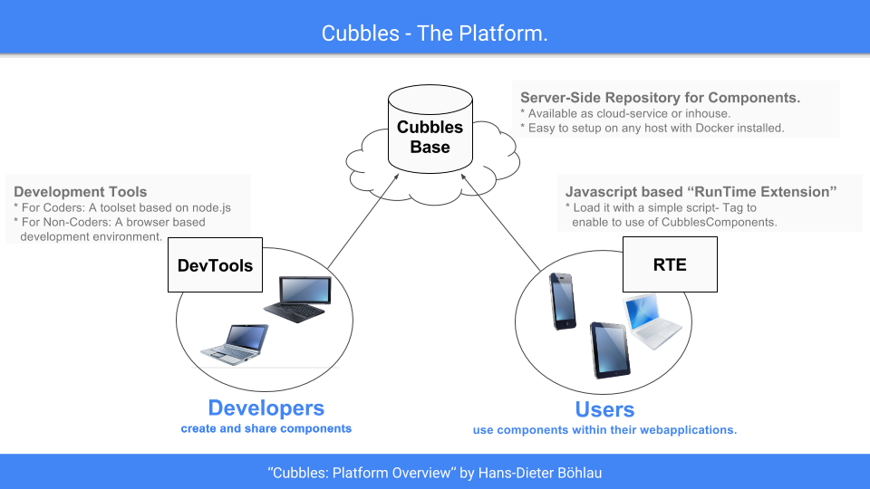

# First steps

The **Cubbles Platform** provides a software infrastructure to support the whole life-cycle of a \(web\) component - from design to usage.

Cubbles Components reside in a server-side repository \(the **Cubbles Base**\). At runtime each Cubbles Component Instance \(aka "**cubble**"\) provides a simple interface to be interoperable a\) with each other and b\) with the DOM-Api.

Cubbles can act as a visual element of your applications user interface, a function block for \(client-side\) data processing and/or a connector to any \(server-side\) 3rd party data service.

In this section you will find the basic information that you need to start using the Cubbles Platform.

