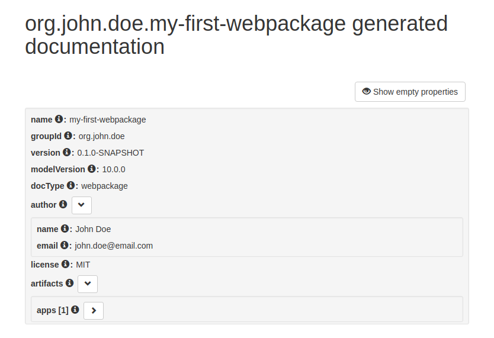

# Create a webpackage

## Purpose

To demonstrate how to create a webpackage using the [Coder DevTools \(CDT\)](../coder-devtools-cdt/).

## Prerequisites

* A Cubbles project was [generated](generate-a-project.md)
* The CDT is a available

## Process

A Webpackage acts as a container for the different artifacts, i.e. components, apps and utilities. It is defined by a file called `manifest.webpackage`, which is a JSON file that describes the internal model of the webpackage and of its artifacts \(Check [this](../terms-and-concepts/webpackage.md) for more info\).

To create a Webpackage you should run the `createWebpackage` task, using the bash you should move to your project's root folder and then to the `devtools` sub folder. There you should run the task:

```bash
grunt +createWebpackage
```

After that, you should provide the following information:

* A name for the webpackage, e.g. "my-first-webpackage"
* A name
* An email address
* And \(optionally\) a webpackage groupId, as kind of namespace for your organization, e.g, com.my.organization

The new webpackage will be the active webpackage. If everything went well you will get a message similar to the following:

```bash
Running "+createWebpackage" task
? WebPackage name (e.g. 'my-package'): my-first-webpackage
? Your name (as the author of the package): John Doe
? Your eMail: john.doe@email.com
? WebPackage groupId (optional, expected to start with your reversed
mail-domain): org.john.doe
Note: The created Webpackage is the new 'activeWebpackage' (@see .workspace)

Done, without errors.
```

> Note that at this stage it is possible to change some webpackage settings. This is not necessary or mandatory for this tutorial. A few possibilities will be mentioned here:
>
> * You can change the parameters of the `.editorconfig` file, for instance if you like working with a different indent\_size.
> * You can add a `.gitignore` file inside your package folder when you want to specify files or folders that should be ignored by the git management.
> * If you want to use bower to download additional libraries in the future you can change the default download folder modifying the `.bowerrc` file.

## Test

To test the webpackage \(its artifacts\), you should start a local webserver running the following command:

```bash
grunt +startWebserver
```

If everything goes well, the bash will display the following message:

```bash
Currently mapped Webpackage: org.john.doe.my-first-webpackage (@see ../webpackages/.workspace)

Running "cubx-http-server:dev" (cubx-http-server) task
Server running on http://localhost:8282/
Hit CTRL-C to stop the server
```

Then, your default web browser will open the [http://localhost:8282](http://localhost:8282) url and show the root of the project folder. Now you can navigate your webpackage \(same name as given above\). It is provided with an artifact called docs, click on it and you will sea a page that allows you visualize the documentation \(manifest\) of your webpackage.



