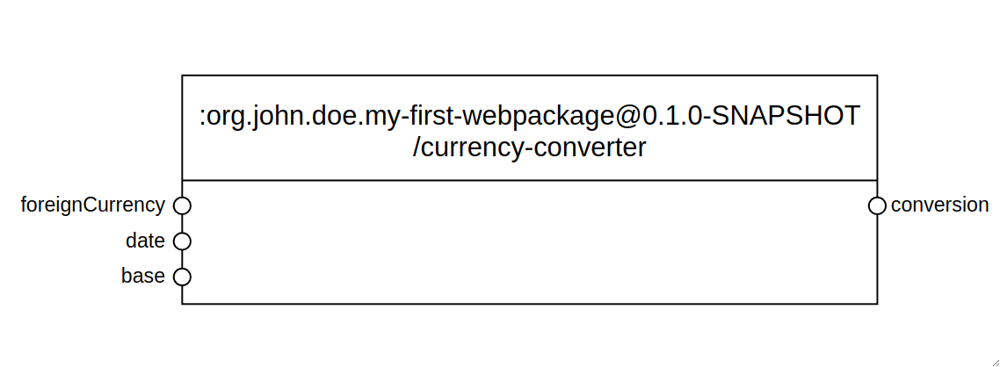
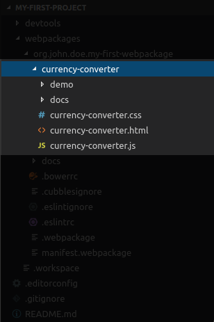
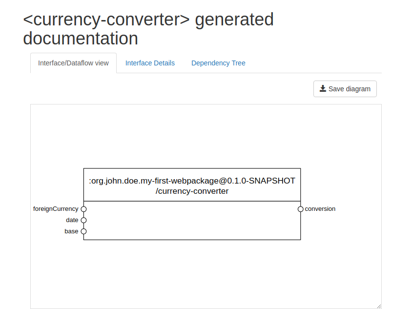
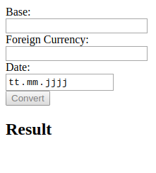
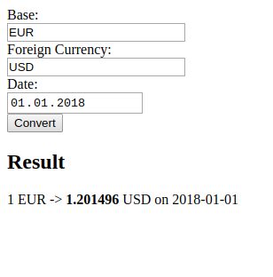

# Create an elementary component

## Purpose

To demonstrate how to create an elementary component using the [Coder DevTools](../coder-devtools-cdt/).

## Prerequisites

* A Cubbles Project was [generated](generate-a-project.md)
* A Webpackage was [created](create-a-webpackage.md)

## The currency-converter Elementary Component

We will create an elementary component called _currency-converter_. It is a component that uses [The Free Currency Converter API](https://free.currencyconverterapi.com) to get current and historical foreign exchange rates. This component will have the following interface \(input slots on the left and output slots on the right\):



## Create an Elementary Component

To create the elementary, you should use the `+webpackage-createElementary` task from the DevTools:

```bash
grunt +webpackage-createElementary
```

Then, you should provide a name and, if you want, a description for the component. In our case, it should be as follows:

* Name: _currency-converter_.
* Description: Elementary that uses an API to Convert currencies.

If everything is okay, you will get the following message in the bash:

```bash
Done, without errors.
```

The grunt task will create some files for our elementary component inside your webpackage folder as follows:



The newly created folder contains two folders, one for the generated demo and the other one for the generated documentation. Also, it contains the following three files:

* _currency-converter.html_: it provides a template for the elementary component, i.e., its HTML code.
* _currency-converter.js_: it contains the logic or behaviour for the elementary component.
* _currency-converter-style.html_: contains CSS style definitions for the elementary component

The`manifest.webpackage` file \(located on the root level of your webpackage folder\) has been modified in the background. It includes some meta information of your current webpackage. Now, it also contains the definition of our elementary component.

```javascript
    // ...
    "elementaryComponents": [
      {
        "artifactId": "currency-converter",
        "description": "Elementary that uses an API to Convert currencies",
        "runnables": [
          {
            "name": "demo",
            "path": "/demo/index.html",
            "description": "Demo app..."
          },
          {
            "name": "docs",
            "path": "/docs/index.html",
            "description": "Show the interface of this component."
          }
        ],
        "resources": [
          "currency-converter.css",
          "currency-converter.html"
        ],
        "dependencies": [
          {
            "webpackageId": "cubx.core.rte@3.0.0-SNAPSHOT",
            "artifactId": "cubxcomponent"
          }
        ],
        "slots": []
      }
    ],
    // ...
```

### Slot Definitions

Now we should add slots that we presented in the interface above. We need three input slots \(foreignCurrency, date, base\) and one output slot \(conversion\) for the component. Those are defined in the slots array of the manifest definition of the component as follows:

```javascript
    // ...
    "slots": [
        {
            "slotId": "base",
            "description": "Code of the currency to be converted",
            "type": "string",
            "direction": [
                "input"
            ],
            "value": "EUR"
        },
        {
            "slotId": "foreignCurrency",
            "description": "Code of the target currency for the conversion",
            "type": "string",
            "direction": [
                "input"
            ],
            "value": "USD"
        },
        {
            "slotId": "date",
            "description": "Date to be used for the conversion",
            "type": "string",
            "direction": [
                "input"
            ],
            "value": "2018-01-01"
        },
        {
            "slotId": "conversion",
            "description": "Result of the conversion",
            "type": "number",
            "direction": [
                "output"
            ]
        }
    ]
    // ...
```

### Check Generated Documentation

Now you can check the generated documentation of the component \(i.e., the interface view, the interface details and the dependency tree\). You should perform the following steps:

* Start the embedded webserver using the `+startWebserver` grunt task available in the [DevTools](../coder-devtools-cdt/).
* Your default browser will start.
* Navigate to: [http://localhost:8282/\[webpackage-name\]/currency-converter/docs/](http://localhost:8282/[webpackage-name]/currency-converter/docs/)

> Note that \[webpackage-name\] should be replaced by the name of your current webpackage.

It should look as follows:



### Changing the View of the Elementary \(.html File\)

Now we need to change the template of the component to define the view of our component. We need three input fields to provide the needed data for the conversion, a button to trigger the conversion and an output text to show the result. The following HTML code meet these requirements.

```markup
<template id="currency-converter">
    <div>
        <div>
            <label>Base:</label>
        </div>
        <div>
            <input type="text" id="base">
        </div>
        <div>
            <label>Foreign Currency:</label>
        </div>
        <div>
            <input type="text" id="foreign">
        </div>
        <div>
            <label>Date:</label>
        </div>
        <div>
            <input type="date" id="date">
        </div>
        <div>
            <input type="button" value="Convert" id="convertBtn" disabled>
        </div>
    </div>
    <h2>Result</h2>
    <div id="result"></div>
</template>

<script src="currency-converter.js"></script>
```

> Note that the HTML code for your component should be located inside the `<template>` tag. Also, the javascript file of the component should be included through a `<script>` tag.

To see the result of the las change, check the generated demo page. Note that the local webserver should be running \(See [above](create-elementary.md#check_generated_documentation)\). Navigate to [http://localhost:8282/\[webpackage-name\]/currency-converter/demo/](http://localhost:8282/[webpackage-name]/currency-converter/demo/). You should see a webpage like the one presented below:



> Note that the component doesn't do anything because it has no associated behaviour.

### Change the Logic of the Elementary \(.js File\)

The file `currency-converter.js` handles the behaviour of the component when a slot value is changed. We should modify the implementation to make a request when a user provides the input data and clicks on the `Convert` button. The following code enables that behaviour.

```javascript
(function () {
  'use strict';

  CubxComponent({
    is: 'currency-converter',

    /**
     * Manipulate an element’s local DOM when the element is created.
     */
    created: function () {},

    /**
     * Manipulate an element’s local DOM when the element is created and initialized.
     */
    ready: function () {},

    /**
     * Manipulate an element’s local DOM when the element is attached to the document.
     */
    connected: function () {},

    /**
     * Manipulate an element’s local DOM when the element is dettached to the document.
     */
    disconnected: function () {},

    /**
     * Manipulate an element’s local DOM when the cubbles framework is initialized and ready to work.
     */
    contextReady: function () {
      this.$.base.setAttribute('value', this.getBase());
      this.$.foreign.setAttribute('value', this.getForeignCurrency());
      this.$.date.setAttribute('value', this.getDate());
      this.sendQuery();

      this.$.convertBtn.addEventListener('click', function () {
        this.getFormValuesAndSendQuery();
      }.bind(this));
      this.$.convertBtn.removeAttribute('disabled');
    },

    /**
     * Observe the 'base' slot to update the view of this component and then
     * send the request to the fixer-io api
     * @param {string} newValue - new value of the slot
     */
    modelBaseChanged: function (newValue) {
      // update the view
      this.$.base.setAttribute('value', newValue);
    },
    /**
     * Observe the 'date' slot to update the view of this component and then
     * send the request to the fixer-io api
     * @param {string} newValue - new value of the slot ('yyyy-mm-dd' format)
     */
    modelDateChanged: function (newValue) {
      // update the view
      this.$.date.setAttribute('value', newValue);
    },
    /**
     * Observe the slot 'foreignCurrency' to update the view of this component
     * and then send the request to the fixer-io api.
     * @param {string} newValue - new value of the slot
     */
    modelForeignCurrencyChanged: function (newValue) {
      // update the view
      this.$.foreign.setAttribute('value', newValue);
    },
    /**
     * Observe the slot 'conversion' to update the view of this component
     * @param {string} newValue - new value of the slot
     */
    modelConversionChanged: function (newValue) {
      // update the view
      this.$.result.innerHTML = '1 ' + this.getBase() + ' -> ' +
        '<b>' + newValue + '</b> ' + this.getForeignCurrency() + ' on ' + this.getDate();
    },
    /**
     * Update the Component-Model and then send the request
     * to the fixer-io api.
     * @param event
     */
    getFormValuesAndSendQuery: function () {
      // Update the Cubbles component model slots the setters
      this.setBase(this.$.base.value);
      this.setDate(this.$.date.value);
      this.setForeignCurrency(this.$.foreign.value);

      this.sendQuery();
    },

    /**
     * Send the request a to the fixer-io api.
     */
    sendQuery: function () {
      // Makes sure all slots are defined
      if (this.getBase() && this.getForeignCurrency()) {
        var conversionKey = this.getBase() + '_' + this.getForeignCurrency();
        var queryDate = this.getDate();
        var baseUrl = 'https://free.currencyconverterapi.com/api/v6/convert';
        var queryUrl = baseUrl + '?q=' + conversionKey +
          '&date=' + queryDate + '&compact=y';
        var self = this;
        
        function processRespond (data) {
          // Update the Cubbles component model slots using the setters
          var converted = data[conversionKey]['val'][queryDate];
          self.setConversion(converted);
          self.setConversionArray([
            [self.getBase(), 1],
            [self.getForeignCurrency(), converted]
          ]);
        }

        this.makeRequest(queryUrl, processRespond)

      }
    },

    /**
     * Make the ajax request
     */
    makeRequest: function (queryUrl, processRespond) {
      var self = this;

      var xhttp = new XMLHttpRequest();
      xhttp.onreadystatechange = function () {
        if (this.readyState == 4 && this.status == 200) {
          var data = JSON.parse(xhttp.responseText);
          processRespond(data);
        }
      };
      xhttp.open("GET", queryUrl, true);
      xhttp.send();
    }
  });
}());

```

> For this tutorial we won't modify the style of our component. However, you can add CSS definitions in the file currency-converter.css.

Now if you check the generated demo and click on the `Convert` button, you will see something as follows:



You can also check the results at the [online demo](https://cubbles.world/sandbox/my-first-webpackage@0.1.0-SNAPSHOT/currency-converter/demo/index.html).

