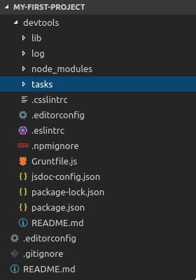

# Generate a project

## Purpose

To demonstrate how to generate a Cubbles project using the [generator-cubbles](https://www.npmjs.com/package/generator-cubbles).

## Prerequisites

* [Nodejs](https://nodejs.org/en/download/) and npm are installed \(Tested with node 6.x to 8.x and npm 3.x to 6.x\).
* Grunt runs from every folder. To do that, start a bash or bash and type the following command:

```bash
npm install -g yo grunt-cli
```

* The [generator-cubbles](https://www.npmjs.com/package/generator-cubbles) is installed. You can install it as any other npm module:

```bash
npm install -g generator-cubbles
```

## Process

Within a Cubbles project you will have access to the [Coder DevTools](../coder-devtools-cdt/) and thus you will be able to create and manage as many [Webpackages](create-a-webpackage.md) as you want. To generate a project, in the bash, navigate to the folder where want to store your project and run the following command:

```bash
yo cubbles:project
```

After that, you will get:

```bash
                 ╭──────────────────────────╮
     _-----_     │    Welcome to the neat   │
    |       |    │    Cubbles WebPackage    │
    |--(o)--|    │        generator!        │
   `---------´   │                          │
    ( _´U`_ )    │    This will create a    │
    /___A___\   /│ "cubbles" project into a │
     |  ~  |     │      new or existing     │
   __'.___.'__   │    sub-folder of your    │
 ´   `  |° ´ Y ` │          choice.         │
                 ╰──────────────────────────╯

? Please provide a folder name:
```

> Note that this tutorial was tested using the 3.2.0 version of the generator-cubbles.

Now, you should type the project name, e.g. my-first-project and choose the RTE version that you want to use. For the effect of this tutorial we will choose cubx.core.rte@3.x.

```bash
? Please provide a folder name:  my-first-project
? Please decide for cubx.core.rte version:  cubx.core.rte@3.x
```

This process creates the overall file and folder structure to use the DevTools a follows:



When finished you will see the following message:

```bash
     _-----_     
    |       |    
    |--(o)--|    ╭──────────────────────────╮
   `---------´   │           Done           │
    ( _´U`_ )    ╰──────────────────────────╯
    /___A___\   /
     |  ~  |     
   __'.___.'__   
 ´   `  |° ´ Y ` 

Note: Within the 'devtools' folder, type 'grunt' to get a list of the most important tasks.


Now I'm running grunt the first time:
Running "default" task
            _     _     _ 
  ___ _   _| |__ | |__ | | ___  ___ 
 / __| | | | '_ \| '_ \| |/ _ \/ __|
| (__| |_| | |_) | |_) | |  __/\__ \
 \___|\__,_|_.__/|_.__/|_|\___||___/


Available Cubbles-Tasks:
 +createWebpackage => Scaffold a new Cubbles-Webpackage.
 +startWebserver => Run a http-Server to get http access to your project files and data.
 +webpackage-createApp => Scaffold a new App in a Webpackage.
 +webpackage-createCompound => Scaffold a new Compound-Component in a Webpackage.
 +webpackage-createElementary => Scaffold a new Elementary-Component in a Webpackage.
 +webpackage-createUtility => Scaffold a new Utility in a Webpackage.
 +webpackage-generateReadmeFile => Generate the README file of a webpackage
 +webpackage-release => Release a webpackage.
 +webpackage-upload => Upload a Cubbles-Webpackage into a Cubbles-Base.
 +webpackage-validateManifestFile => Validate 'manifest.webpackage' file.
 _change-activeWebpackage => Change the active webpackage.
 _createWebpackageDemo => Scaffold a Demo-Webpackage.
 _generateArtifactWctScaffold => Generate a wct scaffold for an Artifact.
 _installKarmaTestDependencies => Makes some recommended test-frameworks available.
 _validateSources => validate js and css
 _webpackage-prepareRelease => Prepare the release of a webpackage
 _webpackage-renameArtifact => Rename a certain artifact
 _webpackage-updateRte => Update rte references in manifest file and in artifact files of a webpackage
 _webpackage-updateToNextVersion => Update manifest to next development version
 _webpackages-bulk-upload => Upload several webpackages.

Done, without errors.
```

> Note that a project includes a suite of DevTools. Thus, this requires the download of a number of npm packages, which takes some time.

