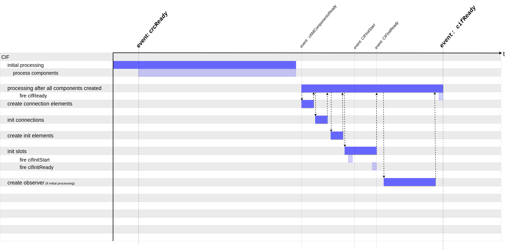
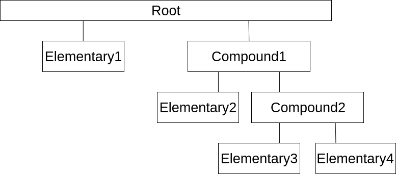
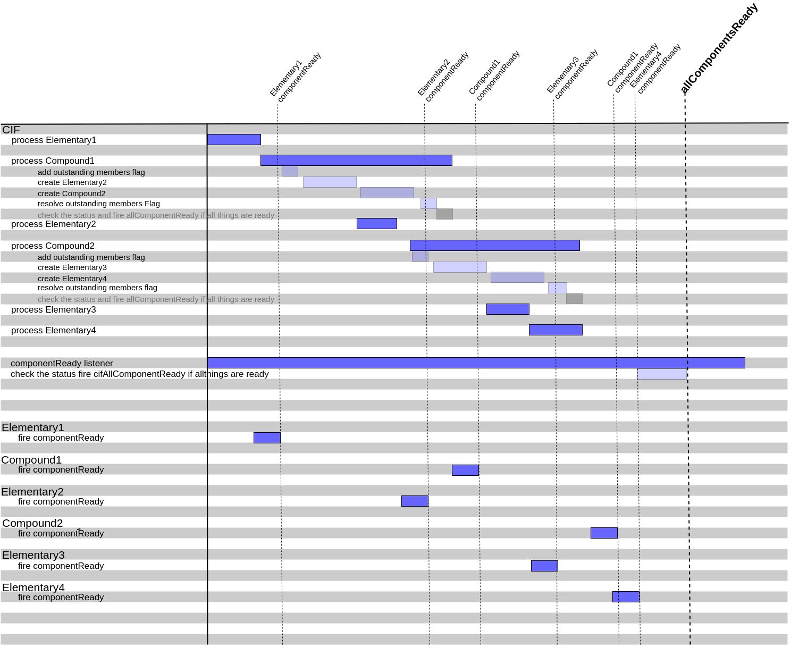

# CIF processing

## CIF initial processing

When the CIF starts the following process is carried out:

1. The initial processing starts after the `crcReady` event is fired
   1. The cubbles in the root context are processed and their child components' elements are created.
2. When all pending tags are created and are ready, the `cifAllComponentsReady` event is fired.
3. The main processing is started
   1. All connection tags are created
   2. The connection tags are parsed, and all connections are registered in the proper context
   3. The slot init tags are created
   4. The `cifInitStart` event is fired, and init tags are
      1. parsed,
      2. sorted and
      3. processed
   5. The `cifInitReady` event is fired
   6. If this process is called from the initial processing, a mutation summary observer is created

The following image  illustrates this process:

## Components processing

To explain the processing of components, let's assume that we are processing a context that have two root components, an elementary and a compound, as illustrated below:

To process that tree, the CIF carry the following process out:

1. `Elementary1` is processed
   1. The required attributes are created (e.g., runtime-id, member-id, etc)
      > **Hint**: when processing existing elements, some required attributes will be created and some existing attribute values will be checked and adjusted to make them valid in the current context.
2. `Compound1` is processed
   1. The required attributes are created (e.g., runtime-id, member-id, etc)
   2. Notify that pending components for `Compound1` exist
   3. Sub-element for `Elementary2` is created and attached
   4. Sub-element for `Compound2` is created and attached
   5. Notify that no pending component for `Compound1` exists anymore
   6. `componentReady` event for `Compound1` is fired
3. `Compound2` is processed
   1. The required attributes are created (e.g., runtime-id, member-id, etc)
   2. Notify that pending components for `Compound2` exist
   3. Sub-element for `Elementary3` is created and attached
   4. Sub-element for `Elementary3` is created and attached
   5. Notify that no pending component for `Compound2` exists anymore
   6. `componentReady` event for `Compound2` is fired

Each of the components; i.e., `Elementary1`,  `Elementary2`, `Elementary3`  and `Elementary4`  fires the `componentReady` event. The `CIF` registers all components first as unready. After the components fire the `componentReady` event, the register will changed to ready. The `CIF`  registers the pending elements (not yet created sub-elements) for each component too. If all components are ready and no pending components exists anymore, the `cifAllComponentsReady` event will be fired.

This process is illustrated below:

> **Hint**: members' elements are created in the order in which they appear in the manifest definition of a compound; or, if a template exists, members are imported and processed in the order in which they appear in the template.