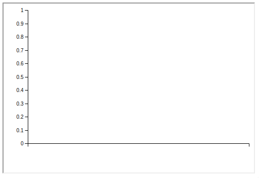
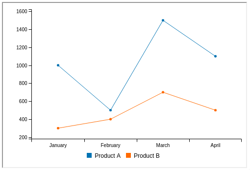

# The Cubbles IFrame API

## Purpose

Cubbles supports the integration of any component into a webpage using the HTML **iframe** element.

This is a useful option if:

1. You are not allowed to place any `<script>` element into the page.
2. The component's integration via the [Cubbles Tag API](cubbles-tag-api/README.md) has side-effects onto the embedding page:
   1. styling side-effects - e.g. if CSS declarations within the component are not consequently defined within their own namespace.
   2. functional side-effects - e.g. if JavaScript dependencies used by the component are in conflict with javascript dependencies of the embedding page.

The [RTE](../README.md) contains a html-resource:

1. that can be referenced using the src-attribute of an `iframe` element,
2. with parameters to
   1. define the component to be loaded
   2. initialize the component with proper values
   3. add dependencies

The following sections present a demo to show the proper use of the Cubbles iframe functionality.

## Demo

### Prerequisites

- The `webpackageId` of the component to be embedded is known (e.g. my-webpackage@1.0.0-SNAPSHOT).
- The `artifactId` of the component to be embedded is known (e.g. my-component).

### Sample case

Let's say you want to show a line chart presenting the sales behavior of your store during the first 4 months of the current year. To aim that, you can use the [line-chart](https://cubbles.world/sandbox/com.incowia.lib.chart-library@1.0.0/line-chart/demo/index.html) component. Let's assume that your sales behavior was as shown in the following table:

| Month | Sold Units of Product A | Sold Units of Product B |
|----------|-------------------------|-------------------------|
| January | 1000 | 300 |
| February | 500 | 400 |
| April | 1100 | 500 |
| March | 1500 | 700 |

### Using iframe app

The `iframe` app allows users to visualize a component within any web page using the html iframe element. To aim that, the `webpackageId` and the `artifactId` of the component should be provided as url parameters. Additionally, the initial values of the component's slots and additional dependencies can be provided using JSON format as url parameters.

The `iframe` app is available at [https://cubbles.world/sandbox/cubx.core.rte@3.0.0-SNAPSHOT/iframe](https://cubbles.world/sandbox/cubx.core.rte@3.0.0-SNAPSHOT/iframe). Therefore, to use it you should provide the url as THE _src_ attribute of an iframe element as follows:

```html
<iframe src="https://cubbles.world/sandbox/cubx.core.rte@3.0.0-SNAPSHOT/iframe"></iframe>
```

Note that the app itself loads nothing, first it should be initialized. The following sections present this process in detail.

### Component initialization (Mandatory)

To initialize the iframe, you should provide the following data of the component:

1. **webpackageId**: in this case it is com.incowia.lib.chart-library@1.0.0
2. **artifactId**: in this it is case line-chart

To provide those ids you should use the webpackge-id and the artifact-id url parameters as shown below:

```html
<iframe src="https://cubbles.world/sandbox/cubx.core.rte@3.0.0-SNAPSHOT/iframe/index.html?webpackage-id=com.incowia.lib.chart-library@1.0.0&amp;artifact-id=line-chart&amp;dependencies=[]"></iframe>
```

> Note: although single quotes are not JSON valid, you can use them to denote a string since double quotes are used to enclose HTML attributes values.

#### Result of component initialization

The result of the code above may look as follows. Click on the image to access a running demo:

[](https://cubbles.world/sandbox/my-first-webpackage@0.1.0-SNAPSHOT/rte-iframe-demo/index.html)

### Component's slots initialization (Optional)

Until now the line chart is empty so you need to provide initial values for the `line-chart` component. We should use the `inits` parameter, which accepts the slots values in JSON format, i.e., {"slot1Name": slot1Value, "slot2Name": slot2Value}.

In our case we need to initialize the component as follows:

| Slot name | Slot value |
|-------------|--------------------------------------------------------------------------|
| dataColumns | [["Product A", 1000, 500, 1500, 1100],["Product B", 300, 400, 700, 500]] |
| xLabels | ["January", "February", "March", "April"] |

The `iframe` should look as follows:

```html
<iframe src="https://cubbles.world/sandbox/ cubx.core.rte@3.0.0-SNAPSHOT/iframe/index.html?webpackage-id=com.incowia.lib.chart-library@1.0.0&amp;artifact-id=line-chart&amp;inits={'dataColumns':[['Product A',1000,500,1500,1100],['Product B',300,400,700,500]],'xLabels':['January','February','March','April']}&dependencies=[]"></iframe>
```

#### Result of inits initialization

The result of the code above may look as follows. Click on the image to access a running demo:

[](https://cubbles.world/sandbox/my-first-webpackage@0.1.0-SNAPSHOT/rte-iframe-demo/initialized.html)

#### Adding dependencies (Optional)

You can also add Cubbles dependencies to the component using the `dependencies` parameter, which accepts an array (JSON format) containing the dependencies like this: [{ "webpackage-id" : "valueX", "artifact-id" : "valueY"}, ...].

For instance if you want to add our [bootstrap](https://cubbles.world/sandbox/bootstrap-3.3.5@1.4.0) utility as dependency the code should look as shown below:

```html
<iframe src="https://cubbles.world/sandbox/ cubx.core.rte@3.0.0-SNAPSHOT/iframe/index.html?webpackage-id=com.incowia.lib ... &dependencies=[{'webpackage-id':'bootstrap-3.3.5@1.4.0','artifact-id':'bootstrap'}]"></iframe>
```

> You might want the Cubbles `iframe` to be resized to adjust to its content. Then, check the [The Cubbles IFrame Resizer API](cubbles-iframe-resizer.md) to know how to do it.
