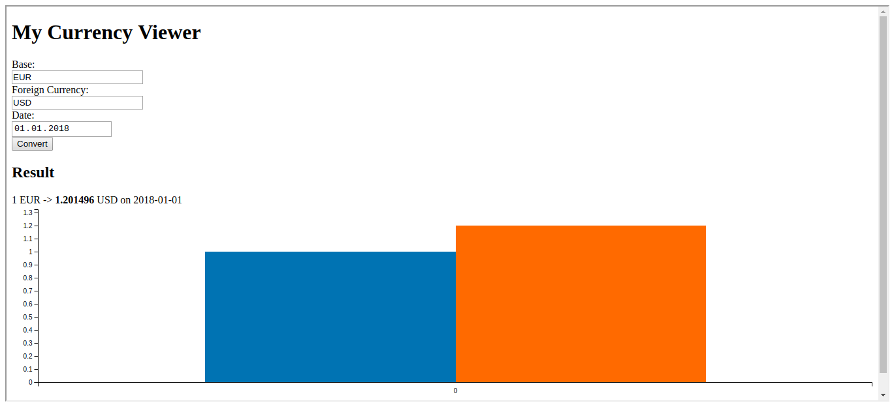

# The Cubbles IFrame Resizer API

## Purpose

Cubbles supports the integration of any component into a webpage using the html **iframe** element (See [The Cubbles IFrame API](./README.md)). However, the iframe will not bet automatically resized to adjust its content, and you may not always be sure of the final size of the iframe.

In that case, you can use the `iframe-resizer` utility to enable the Cubbles `iframe` to resize according to its content. The following sections show how to use the `iframe-resizer` utility to automatically resize a Cubbles iframe.

## Use

If you want the Cubbles `iframe` to be resized automatically according to its content size; you can use the `iframe-resizer` utility. Let's suppose you want to use a Cubbles `iframe` to display the _cubx-maps-demo_ from the _cubx-maps@1.0.0-SNAPSHOT_, you should include an _iframe_ html element as follows (See [The Cubbles IFrame API](./README.md)):

```html
<html>
...
<body>
  <iframe id="myIframe" src="https://cubbles.world/sandbox/cubx.core.rte@3.0.0-SNAPSHOT/iframe/index.html?webpackage-id=my-first-webpackage@0.1.0-SNAPSHOT&amp;artifact-id=currency-viewer"></iframe>
</body>
</html>
```

### Including the iframe-resizer utility

Now you need to include the utility as a script within the head of your html page. By the moment it is available at [https://cubbles.world/core/cubx.core.rte@3.0.0-SNAPSHOT/iframe-resizer/resize.js](https://cubbles.world/core/cubx.core.rte@3.0.0-SNAPSHOT/iframe-resizer/resize.js). Your code should now look as follows:

```html

<html>
<head>
   <script src="https://cubbles.world/sandbox/cubx.core.rte@3.0.0-SNAPSHOT/iframe-resizer/resize.js"></script>
</head>
<body>
  <iframe id="myIframe" src="https://cubbles.world/sandbox/cubx.core.rte@3.0.0-SNAPSHOT/iframe/index.html?webpackage-id=my-first-webpackage@0.1.0-SNAPSHOT&amp;artifact-id=currency-viewer"></iframe>
</body>
</html>
```

### Setting the iframe id

Finally you should:

1. make sure the _id_ attribute of your iframe is set and
2. pass it to the Cubbles iframe using `iframe-id` parameter in the src url:

```html
<html>
<head>
   <script src="https://cubbles.world/sandbox/cubx.core.rte@3.0.0-SNAPSHOT/iframe-resizer/resize.js"></script>
</head>
<body>
  <iframe id="myIframe" src="https://cubbles.world/sandbox/cubx.core.rte@3.0.0-SNAPSHOT/iframe/index.html?iframe-id=myIframe&amp;webpackage-id=my-first-webpackage@0.1.0-SNAPSHOT&amp;artifact-id=currency-viewer"></iframe>
</body>
</html>
```

> Remember that the _id_ of the iframe should be the same as the _iframe-id_ value passed as a parameter, otherwise the resizing wouldn't work.

## Result

The _width_ of the iframe will be set to 100%. The _height_ will be set according to the body content of the iframe whenever it changes as shown below.



Check [this demo](https://cubbles.world/sandbox/my-first-webpackage@0.1.0-SNAPSHOT/rte-iframe-demo/resizer.html) to see the result running online.