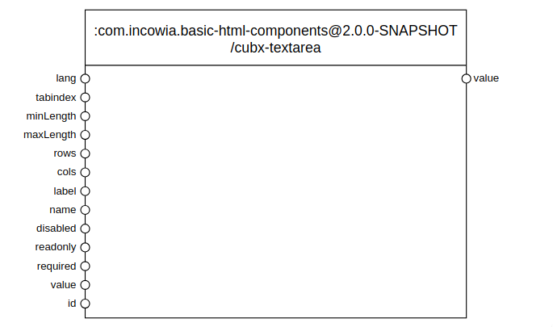

# The Cubbles Javascript API

This section contains a set of tutorials to present how to interact with a `Cubbles` component, using public methods, events and initialization.

## General Prerequisites

To reproduce any of the tutorials of this section the following prerequisites apply:

1. The _com.incowia.basic-html-components@2.0.0-SNAPSHOT/cubx-textarea_ should be available. (You can find it at the  [sandbox store](https://cubbles.world/sandbox/cubx.core.artifactsearch@1.6.1/artifactsearch/index.html))  
2. You are familiarized with the  [creation of elementary components](../../../first-steps/create-elementary.md)
3. You are familiarized with the [The Cubbles Tag API](../cubbles-tag-api/README.md)

## Sample component

To make it easier to explain an understand how to interact with a component, we will use the elementary component called  `cubx-textarea`, whose _webpackge-id_ is `com.incowia.basic-html-components@1.0/cubx-textarea`, along all tutorials of this section. This component wraps a `<textarea>` html element to enable its use as component within the Cubbles platform, allowing some of the html attributes of a textarea to be available as slots. The interface view for this component looks as follows:

## Tutorials

* [Interacting with Cubbles from the outside](./outside-interaction.md)
* [Adding dynamic connections](./dynamic-connections.md)
* [Interacting with Elementary Cubbles from the inside](./inside-interaction.md)