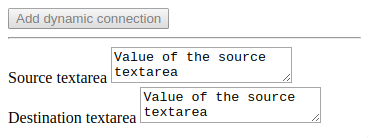

# Adding dynamic connections

The Cubbles Javascript API offers a method called `addDynamicConnection`, which allows adding a connection between two components dynamically, which should be within the same Context. The argument of this method is an instance of the `window.cubx.cif.DynamicConnection` object, which have the following properties:

| Property name | Type | Requirement | Description |
|-----------------|---------|------------------------------------|-----------------------------------------------------------------------------------------------------------------------------------------------------------------------------------------------------------------------------------------------|
| source | object | required | Represents the source of the connection. It has the following properties: <br>- **runtimeId** (string): indicates the runtimeId of the source component <br>- **slot** (string): indicates the name of the source slot of the connection |
| destination | object | required | Represents the target or destination of the connection. It has the following properties: <br>- **runtimeId** (string): indicating the runtimeId of the destination component <br>- **slot** (string): indicating the name of the destination slot of the connection |
| connectionId | string | optional (automatically generated) | Indicates the id for this connection, which should be unique within a context |
| hookFunction | string | optional | Describes a function or the name of a function to be called before a value is set in a destination slot |
| repeatedValues | boolean | optional | Indicates whether a same value can be propagated consecutively |
| copyValue | boolean | optional | Indicates whether the payload of a connection should be copied or not |
| directExecution | boolean | optional | Indicates whether the connection should start working after its creation

## Public methods

To set and validate the properties of a `DynamicConnection` you can use the following methods:

| Method name | Description |
|--------------------------------------|--------------------------------------------------------------------------------------------------------------------------------------------------------------------------------------------------------------------|
| setSource (source) | Sets the source object of a dynamic connection |
| setSourceRuntimeId (runtimeId) | Sets the runtimeId property of the source of a dynamic connection |
| setSourceSlot (slotName) | Sets the slot name of the source of a dynamic connection |
| setDestination (destination) | Sets the destination object of a dynamic connection |
| setDestinationRuntimeId (runtimeId) | Sets the runtimeId of the destination of a dynamic connection |
| setDestinationSlot (slotName) | Sets the slot name of the destination of a dynamic connection |
| setConnectionId (connectionId) | Sets an id to the connection<br>*Note: when you add a new dynamic connection its connectionId will be generated automatically; thus, you don't need to set it.* |
| setCopyValue (copyValue) | Sets the copyValue property of a connection, which indicates whether the payload of the connection should be copied or not |
| setRepeatedValues (repeatedValues) | Sets the repeatedValues property of a connection, which indicates whether the same value can be propagated consecutively |
| setHookFunction (hookFunction) | Sets a function to a connection, which will be called before the value is set to the destination slot |
| setDirectExecution (directExecution) | Sets the directExecution property of a dynamic connection, which indicates whether the connection should start working after its creation; i.e., the current value of the source should be propagated immediately. |
| validate () | Validates all the properties of a dynamic connection. Additionally, it throws and reports errors (if any)

## Creating and adding a dynamic connection

You can create a dynamic connection to add it to an existing component using the methods described above. To create a connection, first, you need to access the source and destination component:

```javascript
...
var sourceTextArea = document.querySelector('#sourceTA');
var destinationTextArea = document.querySelector('#destinationTA');
...
```

Then, you should instantiate and set the properties of a _DynamicConnection_ object:

```javascript
...
var dynCon = new window.cubx.cif.DynamicConnection();


dynCon.setSourceRuntimeId(sourceTextArea.getAttribute('runtime-id'));
dynCon.setSourceSlot('value');
dynCon.setDestinationRuntimeId(destinationTextArea.getAttribute('runtime-id'));
dynCon.setDestinationSlot('value');
dynCon.setDirectExecution(true);
...
```

Finally, you need to access the desired component (source or destination) and add the dynamic connection:

```javascript
...
sourceTextArea.addDynamicConnection(dynCon);
...
```

## A working example

In this demo, we have two instances of our `cubx-textarea` component and will connect their _value_ slots. The first `cubx-textarea` will be the source component, which will have an initial value to see the effect of having the _directExecution_ property set to _true_. The code below allows to:

1. Get the source and destination components from DOM
2. Listen to the 'cifReady' event to enable the 'Add dynamic connection' button
3. Listen to the 'click' event
4. Instantiate and set the properties of the DynamicConnection object
5. Add the DynamicConnection to the source component
6. Disable the 'Add dynamic connection' button

### Code

```html
<!DOCTYPE html>
<html>
<head>
  <meta charset="UTF-8">
  <title>Adding dynamic connections</title>
  <script src="https://cubbles.world/sandbox/cubx.core.rte@3.0.0-SNAPSHOT/webcomponents/custom-elements-es5-adapter.js"></script>
  <script src="https://cubbles.world/sandbox/cubx.core.rte@3.0.0-SNAPSHOT/webcomponents/webcomponents-lite.js"></script>
  <script>
      window.cubx = {
          CRCInit: {
              rootDependencies: [
                  {
                      webpackageId: 'com.incowia.basic-html-components@2.0.0-SNAPSHOT',
                      artifactId: 'cubx-textarea'  
                  }
              ]  
          }
      };
    </script>
  <script src="https://cubbles.world/sandbox/cubx.core.rte@3.0.0-SNAPSHOT/crc-loader/js/main.js" data-crcinit-loadcif="true"></script>
</head>

<body>
  <button id="button" disabled>Add dynamic connection</button>
  <hr>
  <cubx-textarea cubx-webpackage-id="com.incowia.basic-html-components@2.0.0-SNAPSHOT" id="sourceTA">
    <cubx-core-init style="display:none">
        <cubx-core-slot-init slot="value">"Value of the source textarea"</cubx-core-slot-init>
        <cubx-core-slot-init slot="label">"Source textarea"</cubx-core-slot-init>
    </cubx-core-init>
  </cubx-textarea>
  <cubx-textarea cubx-webpackage-id="com.incowia.basic-html-components@2.0.0-SNAPSHOT" id="destinationTA">
    <cubx-core-init style="display:none">
        <cubx-core-slot-init slot="label">"Destination textarea"</cubx-core-slot-init>
    </cubx-core-init>
  </cubx-textarea>
  <script>
(function(){
      'use strict';

      var button = document.querySelector('#button');

      // 1. Get the source and destination components from DOM
      var sourceTextArea = document.querySelector('#sourceTA');
      var destinationTextArea = document.querySelector('#destinationTA');

      // 2. Listen to the 'cifReady' event to enable the 'Add dynamic connection' button
      document.addEventListener('cifReady', function(event) {
        button.removeAttribute('disabled');
});

      // 3. Listen to the 'click' event
      button.addEventListener('click', function () {
        // 4. Instantiate and set the properties of the DynamicConnection object
        var dynCon = new window.cubx.cif.DynamicConnection();
        dynCon.setSourceRuntimeId(sourceTextArea.getAttribute('runtime-id'));
        dynCon.setSourceSlot('value');
        dynCon.setDestinationRuntimeId(destinationTextArea.getAttribute('runtime-id'));
        dynCon.setDestinationSlot('value');
        dynCon.setDirectExecution(true);

        // 5. Add the DynamicConnection to the source component
        sourceTextArea.addDynamicConnection(dynCon);

        // 6. Disable the 'Add dynamic connection' button
        button.setAttribute('disabled', 'disabled');
});
})()
  </script>
</body>
</html>
```

### **Result**



Check [this demo](https://cubbles.world/sandbox/my-first-webpackage@0.1.0-SNAPSHOT/cubbles-js-api-demos/dyn-con-demo.html) to see the result working online.