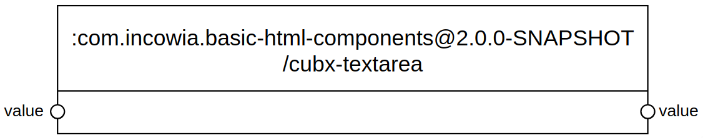
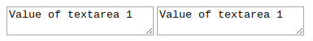
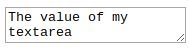

# Interacting with Elementary Cubbles from the inside

You can control the behavior (logic) and view of an elementary component (remember that compound components have no associated logic). When you are developing elementary components you will certainly need to control its behavior; e.g., by setting a slot value, or performing some action after a slot value changes.

## The simplified cubx-textarea sample case

For this tutorial, we will assume that we are developing our `cubx-textarea` component, we will explore how to interact with the elementary from the view, the logic and the manifest (See [Create an Elementary Component](https://cubbles.atlassian.net/wiki/spaces/CDT/pages/6422716/Create+an+Elementary+Component)). For the purpose of this tutorial we will assume that the `cubx-textarea` only have one input/output slot called _value_ as illustrated below.



### The view of our simplified cubx-textarea

Our simplified `cubx-textarea` will contain a normal textarea HTML element, which will be manipulated from the logic layer. The view of our elementary looks as follows:

```html
<template id="cubx-textarea">
    <textarea></textarea>
</template>
// Include the logic of our elementary
<script src="cubx-textarea.js"></script>
```

## The logic of an elementary

### The CubxComponent object

The CubxComponent object provides the global `CubxComponent()` function to register a new Cubble component. It provides the _model_ property to control the state of an elementary component. You should extend this object to code the logic of an elementary.

When programming the logic of an elementary component you will need to access and edit slots' values. You can also use the [public methods](./outside-interaction.md#methods-for-outside-interaction) used to interact from the outside, i.e., _get\[SlotId\]()_, _set\[SlotId\](value)_, _slots ()_ and _repropagate\[SlotId\] ()_. In that case, the component is referenced using _this_ since you are inside the component, e.g. use `this.getValue()` in our `cubx-textarea` elementary to access the value of the _value_ slot. Besides those methods, you can implement the ones described below:

| Method name convention | Description |
|-------------------------|---------------------------------------------------------------------------------------------------------------------------------------------------------------------------------|
| created () | Called when the local DOM of an elementary has been created |
| ready () | Called when the local DOM of an elementary has been initialized |
| connected () | Called when the HTML element of an elementary has been attached to the DOM |
| disconnected () | Called when the HTML element of an elementary has been detached to the DOM |
| contextReady () | Called when the Cubbles framework is ready to work; that is, when all dependencies are included, all components and all connections are created and the initialization is done. |
| model[SlotId]Changed () | Called when the value of a slot has changed after calling the _set\[SlotId\](value)_ method. It is useful when you need to perform additional logic after a slot has changed.|

### Accessing the local DOM of an elementary

You can access the local DOM of an elementary using the standard Javascript selection methods (_this.querySelector(selectors)_ and _this.querySelectorAll(selectors)_). Additionally, you can use the _this.\$\$(selectors)_ shortcut for _this.querySelector(selectors)_. For instance, the code below will return the textarea element contained in our 'cubx-textarea' elementary:

```javascript
var textarea = this.$$('textarea');
```

## Adding logic to the cubx-textarea component

To make our `cubx-textarea` to work properly when the textarea value changes, we will we need extend the logic of our component with:

1. A listener to the _change_ event of the component (e.g. in the _contextReady_ method).
2. A method to update the textarea html when the _value_ slot changes.

That extension can be done extending the *CubxComponent* object. In our case, we will do it in a javascript file (cubx-textarea.js), which was included in the view above.

```javascript
(function () {
  'use strict';

  CubxComponent({
    is: 'cubx-textarea',

    // 1. 'change' event listener
    contextReady: function() {
      this.$$('textarea').addEventListener("change", function () {
        this.setValue(event.target.value);
      }.bind(this), false);
    },

    // 2. update textarea element when the 'value' slot changes
    updateValue: function (newValue) {
      if (newValue !== undefined) {
        this.$$('textarea').value = newValue;
      }
    },
  });
}());
```

### A working example

We will use two instances of the `cubx-textarea` elementary. In this example, we use the [The Cubbles Tag API](../cubbles-tag-api/README.md) to initialize the _value_ slot of one the instances of the component and create a connection between both instances.

#### Code

```html
<!DOCTYPE html>
<html>
<head>
    <meta charset="UTF-8">
    <title>&lt;cubx-textarea&gt;</title>
    <script src="https://cubbles.world/sandbox/cubx.core.rte@3.0.0-SNAPSHOT/webcomponents/custom-elements-es5-adapter.js"></script>
    <script src="https://cubbles.world/sandbox/cubx.core.rte@3.0.0-SNAPSHOT/webcomponents/webcomponents-lite.js"></script>
    <script>
      window.cubx = {
        CRCInit: {
            rootDependencies: [
              {
                    webpackageId: 'com.incowia.basic-html-components@2.0.0-SNAPSHOT',
                    artifactId: 'cubx-textarea'  
              }
            ]  
        }
      };
    </script>
    <script src="https://cubbles.world/sandbox/cubx.core.rte@3.0.0-SNAPSHOT/crc-loader/js/main.js" data-crcinit-loadcif="true"></script>
</head>
<body>
  <cubx-textarea cubx-webpackage-id="com.incowia.basic-html-components@2.0.0-SNAPSHOT" id="textarea1">
    <cubx-core-init style="display:none">
        <cubx-core-slot-init slot="value">"Value of textarea 1"</cubx-core-slot-init>
    </cubx-core-init>
    <cubx-core-connections style="display:none">
        <cubx-core-connection connection-id="valueCon" source="value", destination="textarea2:value"></cubx-core-connection>
    </cubx-core-connections>
  </cubx-textarea>
  <cubx-textarea cubx-webpackage-id="com.incowia.basic-html-components@2.0.0-SNAPSHOT" id="textarea2"></cubx-textarea>
</body>

</html>
```

#### Result



Check [this demo](https://cubbles.world/sandbox/my-first-webpackage@0.1.0-SNAPSHOT/cubbles-js-api-demos/elementary-interaction-demo.html) to see the result working online. *Note that this demo uses the complete version of the cubx-textarea*

## Interaction via initialization

Input slots can be initialized in manifest, so you can pre-defined an initial interaction by default. For elementary components, the slot definition object has a property called _value_. This value will be set to the slot during component initialization; thus, when _cubxReady()_ is called, the slot will have that value.

### A working example

We will initialize the value of the slots of our `cubx-textarea` component. The slots definition should look similar to the one below, note that the initialization occurs due to the _value_ property:

```JSON
...
"slots": [
  {
    "slotId": "value",
    "type": "string",
    "direction": [
      "input",
      "output"
    ],
    "value": "The value of my textarea",
  }
]
...
```

> Note that these initial values will not be propagated since this initialization is only valid for input slots.

This time, we should just use the component to see the result of defining init values for the slots:

#### Code

```html
<!DOCTYPE html>
<html>
<head>
    <meta charset="UTF-8">
    <title>&lt;cubx-textarea&gt;</title>
    <script src="https://cubbles.world/sandbox/cubx.core.rte@3.0.0-SNAPSHOT/webcomponents/custom-elements-es5-adapter.js"></script>
    <script src="https://cubbles.world/sandbox/cubx.core.rte@3.0.0-SNAPSHOT/webcomponents/webcomponents-lite.js"></script>
    <script>
      window.cubx = {
        CRCInit: {
            rootDependencies: [
              {
                    webpackageId: 'com.incowia.basic-html-components@2.0.0-SNAPSHOT',
                    artifactId: 'cubx-textarea'  
              }
            ]  
        }
      };
    </script>
    <script src="https://cubbles.world/sandbox/cubx.core.rte@3.0.0-SNAPSHOT/crc-loader/js/main.js" data-crcinit-loadcif="true"></script>
</head>
<body>
  <cubx-textarea cubx-webpackage-id="com.incowia.basic-html-components@2.0.0-SNAPSHOT"></cubx-textarea>
</body>

</html>
```

#### Result

