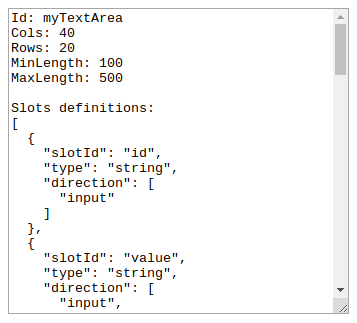
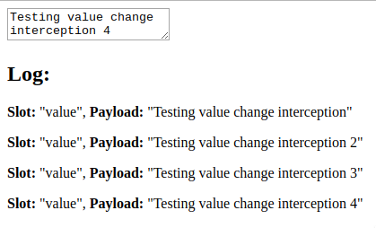

# Interacting with Cubbles from the outside

The Cubbles Platform offers you a set of methods to interact with a Cubble (Compound or Elementary component instance) from outside the component, e.g. from a script associated to the page where the cubble is attached.

In the following sections, those methods are presented and explained using the  `cubx-textarea` component.

## Prerequisites

The prerequisites and sample component presented the [Cubbles Javascript API intro section](./README.md) apply to this tutorial.

## Methods for outside interaction

The methods to interact with a cubble are generated for each slot of a component. The names of the first three methods are composed by a prefix related to the method, followed by the slot's name starting with capital letter; for example, the  _get_  method for a slot called  _value_  would be  _setValue()_. The following table presents and explains the use of these methods:

| Method name convention | Description |
|------------------------------------------|---------------------------------------------------------------------------------------------------------------------------------------------------------------------------------------------------------------------------------------------------------------------------------------------------------|
| get\[SlotId\] () | Get the current internal value of the slot |
| set\[SlotId\] (value) | Set the internal value of the slot. If the slot is an output slot, the value will be propagated afterwards. |
| repropagate\[SlotId\] () | Trigger the propagation of the current internal value of the slot. This method is available for output slots. *Note that when the internal value of a slot changes, an automatic propagation of this value is triggered. So this method is useful when you need to "force" this propagation at any time.* |
| slots () | Return an array containing the definitions of all slots of the component. |
| addDynamicConnection (dynamicConnection) | Add a dynamic connection to the component. (See  [Dynamic connections section](./dynamic-connections.md)) |

### Using the methods

Now to use these methods you should have our component already working; to aim that, you might have an html page like the one shown below:

```html
<!DOCTYPE html>
<html>
<head>
    <meta charset="UTF-8">
    <title>Interacting with &lt;cubx-textarea&gt;</title>
    <script src="https://cubbles.world/sandbox/cubx.core.rte@3.0.0-SNAPSHOT/webcomponents/custom-elements-es5-adapter.js"></script>
    <script src="https://cubbles.world/sandbox/cubx.core.rte@3.0.0-SNAPSHOT/webcomponents/webcomponents-lite.js"></script>
    <script>
      window.cubx = {
          CRCInit: {
              rootDependencies: [
                  {
                      webpackageId: 'com.incowia.basic-html-components@2.0.0-SNAPSHOT',
                      artifactId: 'cubx-textarea'  
                  }
              ]  
          }
      };
    </script>
    <script src="https://cubbles.world/sandbox/cubx.core.rte@3.0.0-SNAPSHOT/crc-loader/js/main.js" data-crcinit-loadcif="true"></script>
</head>
<body>
    <cubx-textarea cubx-webpackage-id="com.incowia.basic-html-components@2.0.0-SNAPSHOT"></cubx-textarea>
</body>
</html>
```

Now to interact with the component, we need to retrieve it from DOM within a script:

```html
...
 <script>
    (function(){
      'use strict';

      // Get the component from DOM
      var cubxTextarea = document.querySelector('cubx-textarea');
      ...
    })()
 </script>
...
```

Then, we should wait until the component is ready to interact:

```html
...
 <script>
    ...
      // Wait until the component is ready to be used
      document.addEventListener('cifReady', function() {
        // Interact with the component using the methods presented above
        cubxTextarea.setId('myTextArea');
        ...
        var textareaId = cubxTextarea.getId();
        ...
      });
    })()
 </script>
...
```

Now, we are ready to use the methods described above.

### A working example

The code below follow the indications presented above using our `cubx-textarea` component to:

1. Get the component from DOM
2. Set some of its slots' values
3. Get those slots' values
4. Get the list of slots' definitions of our component
5. Show the slots values and the whole list of slots within the {{cubx-textarea}}

#### Code

```html
<!DOCTYPE html>
<html>
<head>
  <meta charset="UTF-8">
  <title>Interacting with &lt;cubx-textarea&gt;</title>

  <script src="https://cubbles.world/sandbox/cubx.core.rte@3.0.0-SNAPSHOT/webcomponents/custom-elements-es5-adapter.js"></script>
  <script src="https://cubbles.world/sandbox/cubx.core.rte@3.0.0-SNAPSHOT/webcomponents/webcomponents-lite.js"></script>
  <script>
      window.cubx = {
          CRCInit: {
              rootDependencies: [
                  {
                      webpackageId: 'com.incowia.basic-html-components@2.0.0-SNAPSHOT',
                      artifactId: 'cubx-textarea'  
                  }
              ]  
          }
      };
    </script>
  <script src="https://cubbles.world/sandbox/cubx.core.rte@3.0.0-SNAPSHOT/crc-loader/js/main.js" data-crcinit-loadcif="true"></script>
</head>

<body>
  <cubx-textarea cubx-webpackage-id="com.incowia.basic-html-components@2.0.0-SNAPSHOT"></cubx-textarea>

  <script>
    (function(){
      'use strict';

      // 1. Get the component from DOM
      var cubxTextarea = document.querySelector('cubx-textarea');

      // 2. Wait until the component is ready to be used
      document.addEventListener('cifReady', function() {
        // Use set methods of slots to set the textare
        cubxTextarea.setId('myTextArea');
        cubxTextarea.setCols(40);
        cubxTextarea.setRows(20);
        cubxTextarea.setMinLength(100);
        cubxTextarea.setMaxLength(500);

        // 3. Use the get methods to get slots values and append it to 'textareaValue'
        var textareaValue = '';
        textareaValue += 'Id: ' + cubxTextarea.getId() + '\n';
        textareaValue += 'Cols: ' + cubxTextarea.getCols() + '\n';
        textareaValue += 'Rows: ' + cubxTextarea.getRows() + '\n';
        textareaValue += 'MinLength: ' + cubxTextarea.getMinLength() + '\n';
        textareaValue += 'MaxLength: ' + cubxTextarea.getMaxLength()+ '\n';

        // 4. Get the slots list append it to the 'textareaValue'
        textareaValue += '\nSlots definitions:\n' + JSON.stringify(cubxTextarea.slots(), null, '  ');

        // 5. Set the value of the textarea with the 'textareaValue' string
        cubxTextarea.setValue(textareaValue);
      });
    })()
  </script>
</body>
</html>
```

#### Result



Check [this demo](https://cubbles.world/sandbox/my-first-webpackage@0.1.0-SNAPSHOT/cubbles-js-api-demos/outside-interaction.html) to see the result working online.

## Intercepting changes on output slots

Sometimes it could be useful to detect when the value of an output slot has changed and get this new value, to aim that you just need to listen to the _cifModelChange_ event. Then, to get the slot information you should use  _event.detail_ property, which is an object with the following properties:

1. **slot**: corresponds to the name of the slot whose value has changed
2. **payload**: corresponds to the new value of the slot

### A working example of interception

The only output slot of our  `cubx-textarea`  component is  _value_. The following example will add a  _\<p\>_ element showing the  _slot_  and the  _payload_  properties of the event detail each time the  _value_  slot changes its value. Such change can be triggered by just typing within the textarea and then clicking outside, or pressing tab key, etc.

### Code for interception

```html
<!DOCTYPE html>
<html>
<head>
  <meta charset="UTF-8">
  <title>Interacting with &lt;cubx-textarea&gt;</title>
  <script src="https://cubbles.world/sandbox/cubx.core.rte@3.0.0-SNAPSHOT/webcomponents/custom-elements-es5-adapter.js"></script>
  <script src="https://cubbles.world/sandbox/cubx.core.rte@3.0.0-SNAPSHOT/webcomponents/webcomponents-lite.js"></script>
  <script>
      window.cubx = {
          CRCInit: {
              rootDependencies: [
                  {
                      webpackageId: 'com.incowia.basic-html-components@2.0.0-SNAPSHOT',
                      artifactId: 'cubx-textarea'  
                  }
              ]  
          }
      };
    </script>
  <script src="https://cubbles.world/sandbox/cubx.core.rte@3.0.0-SNAPSHOT/crc-loader/js/main.js" data-crcinit-loadcif="true"></script>
</head>
<body>
  <cubx-textarea cubx-webpackage-id="com.incowia.basic-html-components@2.0.0-SNAPSHOT"></cubx-textarea>

  <h2>Log:</h2>

  <script>
    (function(){
      'use strict';

      // 1. Get the component from DOM
      var cubxTextarea = document.querySelector('cubx-textarea');

      // 2. Listen to the 'cifModelChange' event
      cubxTextarea.addEventListener('cifModelChange', function(event) {
        if (event.detail.slot === 'value') {
          var p = document.createElement('p');
          p.innerHTML = '<strong>Slot: </strong>' + JSON.stringify(event.detail.slot) +
            ', <strong>Payload: </strong>' + JSON.stringify(event.detail.payload);
          document.body.appendChild(p);
        }
      });
    })()
  </script>
</body>
</html>
```

### Final Result

.

Check [this demo](https://cubbles.world/sandbox/my-first-webpackage@0.1.0-SNAPSHOT/cubbles-js-api-demos/slot-change-interception.html) to see the result working online.

## Outside interaction using the model object

The cubbles components have an associated property called _mode_ which is an object. You can use this object to get and set the value of component slot as follows:

```html
...
 <script>
    ...
      // Wait until the component is ready to be used
      document.addEventListener('cifReady', function() {
        // Set the 'value' slot using the model property
        cubxTextarea.model.value = 'Text of the textarea';
        ...
        // Access the 'value' slot using the model property
        var textareaValue = cubxTextarea.model.value;
        ...
      });
    })()
 </script>
...
```
