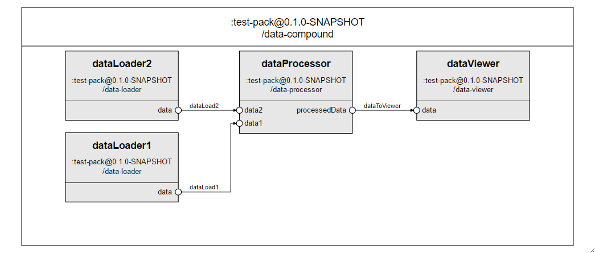

# How to synchronize multiple dataflows between component instances?

Sometimes you will need to synchronize the dataflow of a compound component. Let's say you have a component similar to the data-compound presented below:



Let's say that you need both *data1* and *data2* slots from the *dataProcessor* member to be ready for the *processedData* slot to be set. As you can notice, it is not possible to know which slot will be the first one to be ready. So, we need a way to be sure that both slots are set, no matter the order in which they are loaded. One way you can control this is by:

1. having a handler method which will perform the desired behavior only when everything needed is ready
2. calling this method every time the value of a slot, that need to be synchronized, changes; i.e. using the `model\[SlotId\]Changed ()` (See  [The Cubbles Javascript API](../cubbles-js-api/README.md))

In our case, we will handle this in the data-processor component logic. The code would look similar to:

```javascript
...

/* 1. having a handler method which will perform the desired behavior only when everything needed is ready */
_processData: function() {
    if (this.getData1() and this.getData2()) {
        // Process data
        var processedData = ...


        //Set processedData slot
        this.setProcessedData(processedData);
    }
},


/* 2. calling this method every time the value of a slot, that need to be synchronized, changes; i.e. using the model\[SlotId\]Changed () */
modelData1Changed: function(newData) {
    this._processData();
},

modelData2Changed: function(newData) {
    this._processData();
},
...
```

> **Some considerations**
> - Note that the `data-processor` component is an elementary, and it should be like that since we need to be able to access component logic. Remember, that compounds have no associated logic. In case you don't have a component similar to  `data-processor`, you could create an elementary to handle the synchronization and add it to your original model.
> - If you need additional validation, i.e. not only having the slots set, then you may create validation methods and call them in the condition of the handler method.
> - You may also consider resetting slots when you want to avoid the handler method to process slots when only one or some of them have changed, i.e. when you want to perform something only when all the slots change