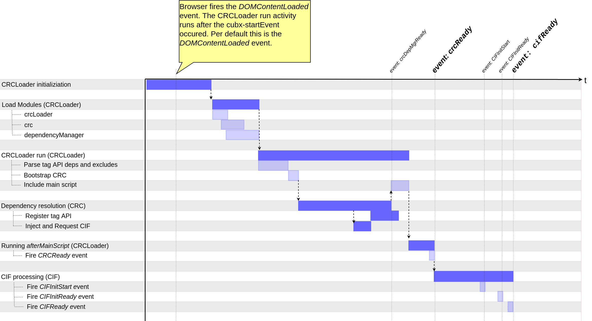

# RTE initialization and rendering timeline

## RTE Bootstrap timeline

## Event API

All the events described below are bubbling; thus, they can be caught (listened) on the document Node.

| Event | Emitter | Description |
|-------------------|----------------------------------------------------------------------|------------------------------------------------------------------------------------------------------------------------------------------------------------------------------------------------------------------------------------|
| crcDepMgrReady | CRC Root Element \* | Indicates that all dependencies are resolved, assigned resources are injected into head section and executed. If there are is an asynchronous execution inside these injected resources, they might not be finished or started at all. |
| crcReady | CRC Root Element\* | Fired if CRC has finished working and the *afterMainScript.js* script was called. |
| cifInitStart | CRC Root Element\* | Fired after CIF has instantiated all Cubbles components on a page and just before all assigned initial slot values are set. |
| cifInitReady | CRC Root Element\* | Fired after all assigned initial slot values are set on each Cubble component instances. |
| cifReady | CRC Root Element\* | Fired when all Cubble components are instantiated and the slot initialization is done. The Cubbles component instances are now ready to use (including their [Javascript API](../cubbles-js-api/README.md)). |
| cifDomUpdateReady | CRC Root Element\* | Replaces the cifReady event when Cubble components are dynamically added to DOM tree after initial CIF processing. |

\* If not specified explicitly, it is the body node