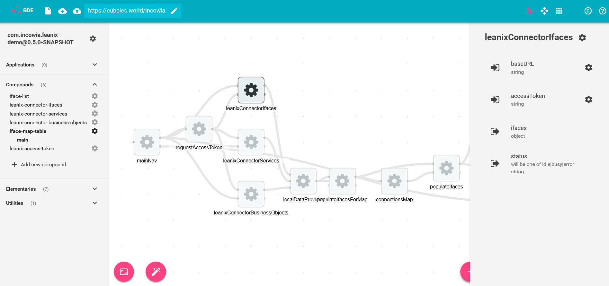

# User roles

## Composer

Composers are component related developers. They can compose \(compound-\) components using any number of existing components. Cubbles provides a Browser-based development environment \(BDE\) for composers.



## Page editor

A Page Editor makes use of a Cubbles component by embedding the corresponding html tag into the body of a web page.

```markup
<body>
    <!--...-->
    <component-c1 cubx-webpackage-id="demo-package@1.0"></component-c1>
    <!--...-->
</body>
```

## App user

For App Users Cubbles is something that works under the hood. Cubbles components are made to be used within 3rd party web apps. From the users point of view, the Cubbles [RTE](../runtime-extension-rte/) and Cubbles components are loaded as any other resources when requesting a web app from their local web browser.

## Coder

Coders are code-related developers. Using a editor of their choice, they can create a webpackage with any type of artifact. Cubbles provides a documented tool-set for coders [\(Coder DevTools\)](../coder-devtools-cdt/).

