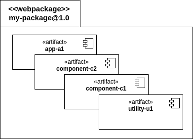

# Webpackage

A **webpackage** is a versioned container for [artifacts](artifacts.md). Each webpackage is described by its manifest file.



> **Version of artifacts**
>
> A webpackage is intended to be used as a collection of related artifacts \(e.g. a component library, a well structured compound or different variants of one component\). Keep in mind, that all artifacts are versioned with the webpackage.

## The manifest.webpackage file

The `manifest.webpackage` file is the most important document of each webpackage since it contains all data describing the webpackage \(and of each of its artifacts\).

In the following sections we will describe the manifest file in a general way. If want a more detailed description of the manifest file please check our [JSON schemas](https://github.com/cubbles/cubx-webpackage-document-api/wiki/manifest.webpackage:-Change-Notes).

> **Model version**
>
> Please note that this document is based on [model version 10](http://cubbles.github.io/cubx-webpackage-document-api/schema-explorer.html?schemaPath=master/lib/jsonSchema/manifestWebpackage-10.0.0.schema.json). Check [this](https://github.com/cubbles/cubx-webpackage-document-api/wiki/manifest.webpackage:-Change-Notes) to explore the valid structure, description and details of a whole manifest file for each model version.

An example of a `manifest.webpackage` file is presented below:

```javascript
{
  "name": "my-webpackage",
  "version": "1.0",
  "modelVersion": "9.1.1",
  "docType": "webpackage",
  "author": {
    "name": "John Doe",
    "email": "john.doe@example.org"
  },
  "contributors": [
    {
        "name": "Jane Doe",
        "email": "jane.doe@example.org"
    }
  ],
  "license": "MIT",
  "homepage": "http://project.home.com",
  "keywords": [
    "connectors",
    "energy"
  ],
  "runnables": [
      {
        "name": "readme",
        "path": "/doc/readme.html",
        "description": "Read this ..."
      }
  ],
  "artifacts": {
    "apps": [
        {
          "artifactId": "app-a1",
          "description": " ...",
          // ...
        }
    ],
    "compoundComponents": [
        {
          "artifactId": "component-c2",
          "description": " ...",
          // ...
        }
    ],
    "elementaryComponents": [
        {
          "artifactId": "component-c1",
          "description": " ...",
          // ...
        }
    ],
    "utilities": [
        {
          "artifactId": "utility-u1",
          "description": " ...",
          // ...
        }
    ]
}
```

### Required properties

The required properties of a manifest file are:

| Property | Observation |
| :--- | :--- |
| version | Version number of the webpackage. Use -SNAPSHOT suffix for work in progress, e.g., 1.0.0, 6.0.1-SNAPSHOT |
| name | The name of the webpackage |
| modelVersion | Version of the webpackage specification |
| license | License name. For recommended values see [this](https://spdx.org/licenses/) |
| groupId | A namespace for the webpackage \(e.g. org.example\). It may also be "" |
| docType | Type of this document \(it must be "webpackage"\) |
| author | The author of this webpackage |
| artifacts | Artifacts represent independent parts of a webpackage - with an enclosed responsibility and usable as a dependency of other artifacts. \(More details [below](webpackage.md#the-artifacts-property)\) |

### Optional-properties

| Property | Observation |
| :--- | :--- |
| description | A short description of the webpackage |
| contributors | A list of contributors of this webpackage |
| homepage | The url of the webpackage's related website |
| keywords | Keywords which support other developers to find this webpackage |
| man | 1 or more urls to external manual\(s\) related to this webpackage |
| runnables | Resources that are actually runnable in a users webbrowser, e.g. html files |

### The artifacts property

The `artifacts` property of the manifest is an object containing the definition of each app, compound component, elementary component and utility that belongs to the webpackage \(Check [this](artifacts.md) for more information\). Below we provide a brief description of the properties used for defining an artifact within a manifest.

| Property | Observation | apps | compound Components | elementary Components | utils |
| :--- | :--- | :--- | :--- | :--- | :--- |
| artifactId | A name for this artifact. It should be unique within the webpackage | **Required** | **Required** | **Required** | **Required** |
| description | Description of this artifact: responsibility, usage scenarios | Optional | Optional | Optional | Optional |
| runnables | Resources that are actually runnable in a users web browser | **Required** | Optional | Optional | Optional |
| resources | Contains the first-level resources, which will be used by the artifact | Optional | **Required** | **Required** | **Required** |
| dependencies | 0 or more artifacts needed for this artifact to work properly. For the sake of backwards compatibility down to model version 8 you can reference endpoints as well. Note: 'webpackage': 'this' refers artifact\(s\) of this webpackage | Optional | Optional | Optional | Optional |
| dependencyExcludes | 0 or more artifacts, which will be excluded from dependency tree. | Optional | Optional | Optional | Optional |
| slots | 1 or more slots to exchange data with other elementaries or compounds | _Not used_ | Optional | Optional | _Not used_ |
| members | Referenced components \(elementaries or compounds\) acting as members of this compound component | _Not used_ | **Required** | _Not used_ | _Not used_ |
| connections | List of connections between the members and between members and this compound component | _Not used_ | **Required** | _Not used_ | _Not used_ |
| inits | List of slot inits of the compound and member component\(s\) | _Not used_ | Optional | _Not used_ | _Not used_ |

An example of a compoundComponent definition is presented below:

```javascript
{
  // ...
  "artifacts": {
    // ...
    "compoundComponents": [
        {
            "artifactId": "compound-component",
            "description": "This is a compound component",
            "runnables": [
                {
                    "name": "demo",
                    "path": "/demo/index.html",
                    "description": "Demo app..."
                }
            ],
            "slots": [
                {
                    "slotId": "input",
                    "type": "string",
                    "direction": [
                      "input"
                    ],
                    "value": "inputText"
                }
            ],
            "members": [
                {
                    "memberId": "firstMember",
                    "artifactId": "member-artifact-id"
                }
            ],
            "connections": [
                {
                    "connectionId": "input",
                    "source": {
                          "slot": "input"
                    },
                    "destination": {
                          "memberIdRef": "firstMember",
                          "slot": "firstMemberInput"
                    }
                }
            ],
            "inits": [
                {
                    "slot": "type",
                    "value": "text",
                    "memberIdRef": "input"
                }
             ],
            "resources": [
                  "css/compound-component.css"
             ],
            "dependencies": [
                 {
                    "artifactId": "member-artifact-id"
                 }
             ]
        }
    ],
    // ...
}
```

